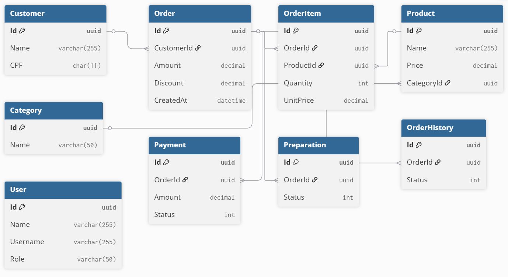

# 💳 TechFood Payment Service

[](https://github.com/TechChallenge-Team/techfood-payment)
[](https://dotnet.microsoft.com/)
[](https://opensource.org/licenses/MIT)

Microserviço de gerenciamento de pagamentos do ecossistema TechFood. Responsável por processar pagamentos via Mercado Pago, gerenciar webhooks e comunicar status de pagamento para outros serviços via RabbitMQ.

## 🎯 Responsabilidades do Serviço

- **Processamento de Pagamentos**: Integração com Mercado Pago para geração de QR Code e processamento de pagamentos
- **Gerenciamento de Webhooks**: Recebe notificações do Mercado Pago sobre status de pagamento
- **Event-Driven Architecture**: Consome eventos de criação de pedidos e publica eventos de confirmação de pagamento
- **Persistência**: Armazena histórico de transações e status de pagamentos

## 📋 Table of Contents

- [Responsabilidades do Serviço](#-responsabilidades-do-serviço)
- [Architecture](#-architecture)
- [Technologies Used](#-technologies-used)
- [Project Structure](#-project-structure)
- [Getting Started](#-getting-started)
- [Event-Driven Communication](#-event-driven-communication)
- [API Documentation](#-api-documentation)
- [Configuration](#-configuration)
- [Database Schema](#-database-schema)
- [Team Members](#-team-members)

## 🏗️ Architecture

O Payment Service segue uma arquitetura hexagonal (ports and adapters) com separação clara de responsabilidades:

```
┌─────────────────────────────────────────────────────────────┐
│                     Payment Service                          │
├─────────────────────────────────────────────────────────────┤
│  ┌──────────────┐  ┌──────────────┐  ┌──────────────┐      │
│  │ Payment.Api  │  │Payment.WebHook│ │Mercado Pago  │      │
│  │              │  │               │  │   (External) │      │
│  │ - REST API   │  │ - Webhook     │  │              │      │
│  │ - Swagger    │  │ - Consumer    │  │              │      │
│  └──────┬───────┘  └──────┬────────┘  └──────────────┘      │
│         │                  │                                  │
│  ┌──────▼──────────────────▼──────────┐                      │
│  │    Payment.Application               │                     │
│  │  - Commands/Queries (CQRS)          │                     │
│  │  - Event Handlers                   │                     │
│  │  - DTOs                             │                     │
│  └──────────────┬──────────────────────┘                     │
│                 │                                             │
│  ┌──────────────▼──────────────────────┐                     │
│  │      Payment.Domain                 │                     │
│  │  - Entities (Payment)               │                     │
│  │  - Business Rules                   │                     │
│  │  - Domain Events                    │                     │
│  └──────────────┬──────────────────────┘                     │
│                 │                                             │
│  ┌──────────────▼──────────────────────┐                     │
│  │      Payment.Infra                  │                     │
│  │  - SQL Server (EF Core)             │                     │
│  │  - RabbitMQ EventBus                │                     │
│  │  - External Services                │                     │
│  └─────────────────────────────────────┘                     │
└─────────────────────────────────────────────────────────────┘

              ▲                            │
              │ OrderCreated               │ PaymentConfirmed
              │ Event                      ▼ Event
         ┌────┴─────┐              ┌────────────┐
         │  Order   │              │   Order    │
         │ Service  │              │  Service   │
         └──────────┘              └────────────┘
```

### Key Components

- **Payment.Api**: REST API para criação e consulta de pagamentos
- **Payment.WebHook**: Worker que recebe webhooks do Mercado Pago e consome eventos
- **Payment.Application**: Camada de aplicação com handlers de comandos e eventos
- **Payment.Domain**: Lógica de negócio e entidades de domínio
- **Payment.Infra**: Implementação de persistência e integrações externas

## 🛠️ Technologies Used

### Backend

- **ASP.NET Core 8.0** - Web API framework
- **Entity Framework Core** - ORM for database access
- **MediatR 9.0** - CQRS and event handling
- **SQL Server** - Relational database
- **RabbitMQ** - Message broker for event-driven communication

### External Integrations

- **Mercado Pago API** - Payment gateway integration
- **TechFood.Shared** - Shared libraries (Domain, Application, Infra, Worker)

### Infrastructure & DevOps

- **Docker & Docker Compose** - Containerization
- **RabbitMQ** - Event bus for inter-service communication
- **Health Checks** - Application monitoring and readiness probes

## 📁 Project Structure

```
techfood-payment/
├── src/
│   ├── TechFood.Payment.Api/              # REST API
│   │   ├── Controllers/
│   │   │   └── PaymentsController.cs      # Payment endpoints
│   │   ├── Program.cs
│   │   └── appsettings.json
│   │
│   ├── TechFood.Payment.WebHook/          # Background Worker
│   │   ├── Program.cs                      # Consumer & Webhook receiver
│   │   └── appsettings.json
│   │
│   ├── TechFood.Payment.Application/      # Application Layer
│   │   ├── Payments/
│   │   │   ├── Commands/
│   │   │   │   ├── CreatePayment/         # Create payment command
│   │   │   │   └── ConfirmPayment/        # Confirm payment command
│   │   │   ├── Events/
│   │   │   │   ├── OrderCreatedEventHandler.cs    # Consumes OrderCreated
│   │   │   │   └── ConfirmedPaymentEvent.cs       # Publishes PaymentConfirmed
│   │   │   └── Dto/
│   │   ├── Common/
│   │   │   └── Services/
│   │   │       └── Interfaces/
│   │   │           ├── IOrderService.cs   # Order HTTP client
│   │   │           ├── IBackofficeService.cs
│   │   │           └── IPaymentService.cs # Mercado Pago abstraction
│   │   └── DependencyInjection.cs
│   │
│   ├── TechFood.Payment.Domain/           # Domain Layer
│   │   ├── Entities/
│   │   │   └── Payment.cs                 # Payment aggregate
│   │   └── Repositories/
│   │       └── IPaymentRepository.cs
│   │
│   ├── TechFood.Payment.Infra/           # Infrastructure Layer
│   │   ├── Persistence/
│   │   │   ├── Contexts/
│   │   │   │   └── PaymentContext.cs     # EF DbContext
│   │   │   └── Repositories/
│   │   │       └── PaymentRepository.cs
│   │   ├── Payments/
│   │   │   └── MercadoPago/              # Mercado Pago integration
│   │   │       └── MercadoPagoPaymentService.cs
│   │   ├── Order/
│   │   │   └── OrderService.cs           # HTTP client to Order service
│   │   ├── Backoffice/
│   │   │   └── BackofficeService.cs      # HTTP client to Backoffice
│   │   └── DependencyInjection.cs
│   │
│   └── TechFood.Payment.Contracts/       # DTOs and Contracts
│
├── tests/
│   ├── TechFood.Payment.Api.Tests/
│   ├── TechFood.Payment.Application.Tests/
│   └── TechFood.Payment.Infra.Tests/
│
└── docs/                                  # Documentation
    └── Mercado Pago Developers.postman_collection.json
```

## 🚀 Getting Started

### Prerequisites

- **.NET 8.0 SDK** - [Download](https://dotnet.microsoft.com/download/dotnet/8.0)
- **SQL Server** - LocalDB or Docker container
- **RabbitMQ** - Message broker for events

### Quick Start

1. **Clone the repository**

   ```bash
   git clone <repository-url>
   cd techfood-payment
   ```

2. **Start RabbitMQ (Docker)**

   ```bash
   docker run -d --name rabbitmq \
     -p 5672:5672 \
     -p 15672:15672 \
     rabbitmq:3-management
   ```

3. **Update Configuration**

   Edit `appsettings.json` in both `Payment.Api` and `Payment.WebHook`:

   ```json
   {
     "ConnectionStrings": {
       "DataBaseConection": "Server=(localdb)\\mssqllocaldb;Initial Catalog=dbtechfood.payment;..."
     },
     "EventBus": {
       "RabbitMQ": {
         "HostName": "localhost",
         "Port": 5672,
         "UserName": "guest",
         "Password": "guest"
       }
     },
     "Services": {
       "Order": "http://localhost:45001/",
       "Backoffice": "http://localhost:45004/"
     }
   }
   ```

4. **Run Database Migrations**

   ```bash
   cd src/TechFood.Payment.Api
   dotnet ef database update
   ```

5. **Start Payment API**

   ```bash
   cd src/TechFood.Payment.Api
   dotnet run
   ```

   API will be available at: `http://localhost:45002`
   Swagger: `http://localhost:45002/swagger`

6. **Start Payment WebHook Worker**

   ```bash
   cd src/TechFood.Payment.WebHook
   dotnet run
   ```

   The worker will automatically subscribe to `OrderCreatedIntegrationEvent`

## 🔄 Event-Driven Communication

O Payment Service participa da arquitetura orientada a eventos do TechFood:

### Events Consumed

#### `OrderCreatedIntegrationEvent`
- **Source**: Order Service
- **Handler**: `OrderCreatedEventHandler`
- **Action**: Cria pagamento automaticamente para o pedido
- **Queue**: `TechFood.Payment.WebHook_OrderCreatedIntegrationEvent_queue`

**Event Structure**:
```csharp
public record OrderCreatedIntegrationEvent(
    Guid OrderId,
    List<OrderItemCreatedDto> Items
) : IIntegrationEvent;
```

**Flow**:
```
Order.Api creates order
    ↓ Publishes OrderCreatedIntegrationEvent
RabbitMQ (techfood.events.exchange)
    ↓ Routes to Payment.WebHook queue
Payment.WebHook consumes event
    ↓ Invokes OrderCreatedEventHandler
    ↓ Sends CreatePaymentCommand
CreatePaymentCommandHandler
    ↓ Calls Order Service for order details
    ↓ Generates Mercado Pago QR Code
    ↓ Saves payment in database
    ✅ Payment created with status PENDING
```

### Events Published

#### `ConfirmedPaymentEvent`
- **Target**: Order Service
- **Action**: Notifica que pagamento foi confirmado
- **Routing Key**: `ConfirmedPaymentEvent`

**Event Structure**:
```csharp
public class ConfirmedPaymentEvent : IIntegrationEvent
{
    public Guid PaymentId { get; set; }
    public Guid OrderId { get; set; }
}
```

**Flow**:
```
Mercado Pago webhook notification
    ↓ POST /v1/payments/{id}
Payment.Api confirms payment
    ↓ Publishes ConfirmedPaymentEvent
RabbitMQ (techfood.events.exchange)
    ↓ Routes to Order.Worker queue
Order.Worker consumes event
    ✅ Updates order status to RECEIVED
```

### RabbitMQ Configuration

- **Exchange**: `techfood.events.exchange` (Topic)
- **Exchange Type**: Topic
- **Durable**: Yes
- **Auto Delete**: No

**Queues**:
- `TechFood.Payment.WebHook_OrderCreatedIntegrationEvent_queue`
  - Bound to routing key: `OrderCreatedIntegrationEvent`
  - Durable: Yes
  - Exclusive: No

## 📚 API Documentation

### Swagger UI

Access the interactive API documentation at: `http://localhost:45002/swagger`

### Available Endpoints

#### Create Payment
```http
POST /v1/payments
Content-Type: application/json

{
  "orderId": "3fa85f64-5717-4562-b3fc-2c963f66afa6",
  "type": 1  // 1 = MercadoPago, 2 = CreditCard
}
```

**Response**:
```json
{
  "id": "3fa85f64-5717-4562-b3fc-2c963f66afa6",
  "orderId": "3fa85f64-5717-4562-b3fc-2c963f66afa6",
  "createdAt": "2025-12-18T10:30:00",
  "paidAt": null,
  "type": 1,
  "status": 0,  // 0 = Pending, 1 = Confirmed, 2 = Failed
  "amount": 59.90
}
```

#### Confirm Payment (Webhook)
```http
PATCH /v1/payments/{id}
```

**Response**: `200 OK`

### Payment Flow Example

1. **Order Service creates order** → Publishes `OrderCreatedIntegrationEvent`
2. **Payment Worker receives event** → Automatically creates payment
3. **Customer scans QR Code** → Pays via Mercado Pago
4. **Mercado Pago sends webhook** → POST to `/v1/payments/{id}`
5. **Payment API confirms payment** → Publishes `ConfirmedPaymentEvent`
6. **Order Service receives confirmation** → Updates order status

### Test Credentials

The application comes with pre-configured test credentials for Mercado Pago payment integration:

- **Seller Username**: `TESTUSER1125814911`
- **Seller Password**: `DD1wLKK8sd`
- **Customer Username**: `TESTUSER1370967485`
- **Customer Password**: `ayGV80NpxL`
- **User ID**: `2414323212`
- **Access Token**: `APP_USR-5808215342931102-042817-5d5fee5e46fe9a6b08d17f29e741091f-2414323212`

### Database Connection

The default database connection string used by the API:

**Connection String**: `Server=techfood.db;Database=techfood_payment;User Id=sa;Password=123456#4EA;TrustServerCertificate=True;`

_Note: These credentials are for development/testing purposes only. For production deployments, ensure to use secure credentials and proper environment variable management._

## Order Flow - Swagger

After starting the application, all the endpoints can be tested using Swagger, which is available at the following URL: [http://localhost:5000/api/swagger/index.html](http://localhost:5000/api/swagger/index.html).

**Creating a new order**:

Do a post to endpoint `/v1/orders`:


Obs: to get the `productId`, you can use the endpoint `/v1/products` to list all products. if there is no products, follow the step - **Admin Flow - Swagger**

**Creating a new payment**:

After creating an order, you can create a new payment by doing a post to endpoint `/v1/payments`:


You should get as response the QR code to be scanned by the consumer to complete the payment.


After the payment a weebhook will be called to update the order status to PAID and the preparation status to PENDING.

Obs: The weebhook is not implemented yet so you can call directly the endpoint `/v1/payments/{paymentId}`

**Changing preparation status**:

To change the preparation status, you can do a PATCH to the following endpoints:


- `/v1/preparations/{preparationId}/start` to change the status to INPROGRESS.
- `/v1/preparations/{preparationId}/finish` to change the status to DONE.
- `/v1/preparations/{preparationId}/cancel` to change the status to CANCELLED.

After changing the preparation status to DONE you can finish the order and preparation flow doing a PATCH to the endpoint `/v1/orders/{orderId}/finish`.

## Admin Flow - Swagger

In order to create a new product, first you need to create a catergory by doing a post to endpoint `/v1/categories`:


Then, you can create a new product by doing a post to endpoint `/v1/products`:


## Order Flow - Frontend

1. **Consumer**: The consumer uses the self-order application to browse the menu, select items, and place an order. The order is then sent to the restaurant for preparation:


2. **Restaurant**: The restaurant receives the order through the admin panel, where they can manage the menu and track order preparation and delivery:


# Documentação Banco de Dados

### 1. Modelagem de entidade relacional



### 2. Dicionário de Dados TechFood

| Tabela      | Campo      | Tipo          | Observações                                  |
| ----------- | ---------- | ------------- | -------------------------------------------- |
| Customer    | Id         | UUID (PK)     | Identificador único                          |
| Customer    | Name       | VARCHAR(255)  | Nome do cliente                              |
| Customer    | CPF        | CHAR(11)      | Documento único                              |
| Order       | Id         | UUID (PK)     | Identificador do pedido                      |
| Order       | CustomerId | UUID (FK)     | Relaciona com Customer                       |
| Order       | Amount     | DECIMAL(10,2) | Valor bruto                                  |
| OrderItem   | Id         | UUID (PK)     | Identificador do item                        |
| OrderItem   | ProductId  | UUID (FK)     | Relaciona com Product                        |
| Product     | Id         | UUID (PK)     | Identificador único                          |
| Product     | Name       | VARCHAR(255)  | Nome do produto                              |
| Category    | Id         | UUID (PK)     | Identificador da categoria                   |
| Payment     | Id         | UUID (PK)     | Identificador do pagamento                   |
| Payment     | Status     | INT           | 0 = pendente, 1 = pago, 2 = falhou           |
| Preparation | Id         | UUID (PK)     | Identificador da etapa                       |
| User        | Id         | UUID (PK)     | Identificador do usuário (admin/funcionário) |

## 3. **Justificativa – AWS RDS**

O banco será hospedado no **AWS RDS SQLServer** pelos seguintes motivos:

- **Gerenciamento automático**: backups, atualizações de versão, replicação e failover.
- **Escalabilidade**: suporte a leitura em réplicas (read replicas).
- **Segurança**: criptografia em repouso (KMS), em trânsito (TLS), integração com IAM e VPC.
- **Custo-benefício**: elimina necessidade de administrar infraestrutura, foca no desenvolvimento.
- **Compatibilidade**: suporte a engines amplamente utilizadas no mercado.

## 4. **Justificativa do Time**

“Optamos pelo **AWS RDS SQLServer** por se tratar de um banco de dados relacional totalmente gerenciado, com suporte a escalabilidade horizontal e vertical, alta disponibilidade via Multi-AZ e segurança integrada com IAM e KMS. Além disso, o **SQLServer** oferece recursos avançados de modelagem (constraints, índices, JSONB para dados semiestruturados) que suportam o crescimento do sistema da Techfood.”

## 🧪 Testing

### Unit Tests

```bash
# Run all tests
dotnet test TechFood.Payment.sln

# Run with coverage
dotnet test /p:CollectCoverage=true /p:CoverletOutputFormat=opencover
```

### Integration Tests

```bash
# Run integration tests
dotnet test tests/TechFood.Payment.Integration.Tests
```

### Manual Testing with Postman

Import the Mercado Pago collection from `docs/Mercado Pago Developers.postman_collection.json`

## 🚀 Deployment

### Docker Compose (Development)

```yaml
version: '3.8'
services:
  payment-api:
    build: ./src/TechFood.Payment.Api
    ports:
      - "45002:80"
    environment:
      - ConnectionStrings__DataBaseConection=...
      - EventBus__RabbitMQ__HostName=rabbitmq
    depends_on:
      - rabbitmq
      - sqlserver
  
  payment-webhook:
    build: ./src/TechFood.Payment.WebHook
    environment:
      - ConnectionStrings__DataBaseConection=...
      - EventBus__RabbitMQ__HostName=rabbitmq
    depends_on:
      - rabbitmq
      - sqlserver
```

### Health Checks

- **Payment.Api**: `GET /health`
- **Payment.WebHook**: Background service logs

## 📖 Related Documentation

- [TechFood Order Service](https://github.com/TechChallenge-Team/techfood-order)
- [TechFood Shared Libraries](https://github.com/TechChallenge-Team/techfood-shared)
- [Mercado Pago API Documentation](https://www.mercadopago.com.br/developers)

## 👥 Team Members

- [Elias Soares - RM 362904](https://github.com/eliassoaressouza)
- [Paulo Viana - RM 364330](https://github.com/Phviana)
- [Valdeir Silva - RM 363809](https://github.com/Valdeirsilva2)
- [Leonardo Borges - RM 363195](https://github.com/ldssBorges)
- [Leandro Cervantes - RM 361335](https://github.com/leandrocervant)

---

**TechFood Payment Service** - Part of the TechFood Microservices Ecosystem 🍔💳 
